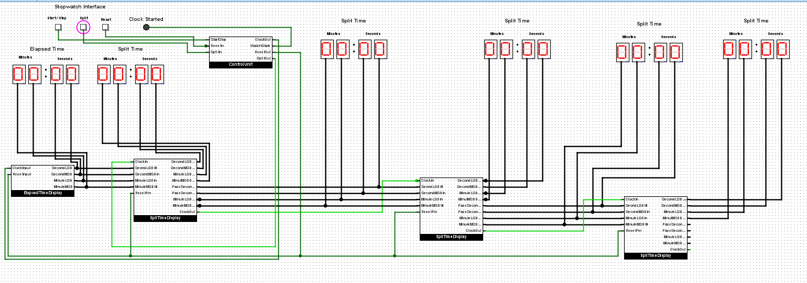
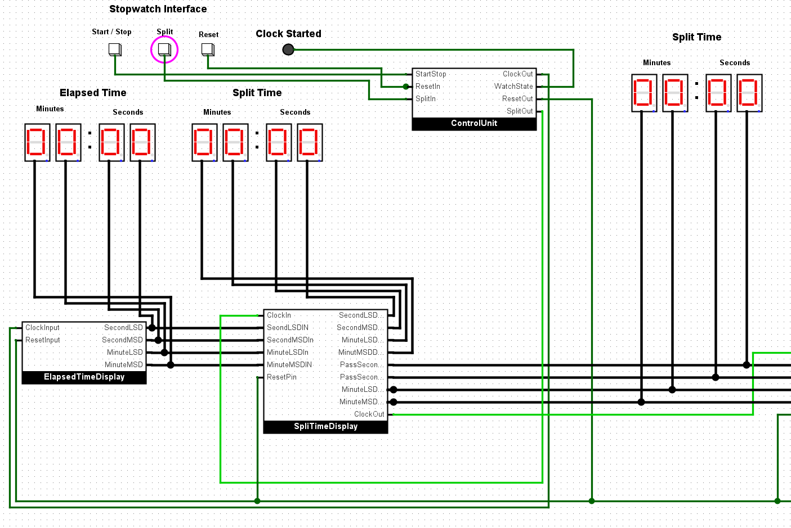
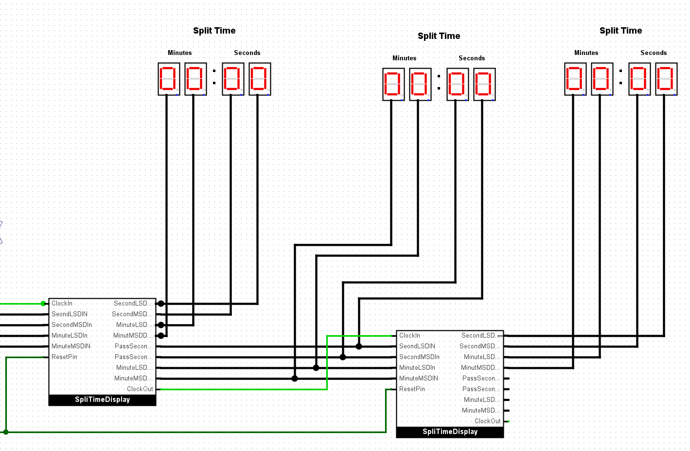
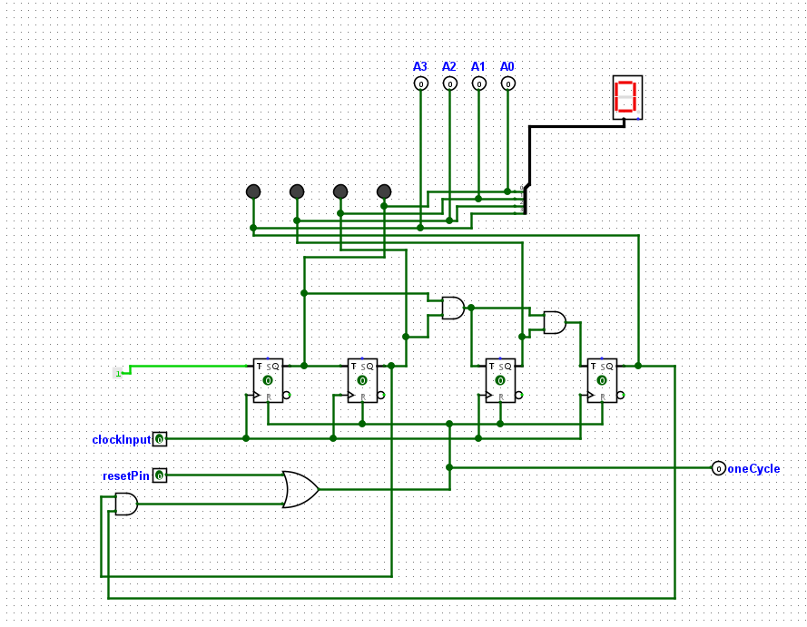
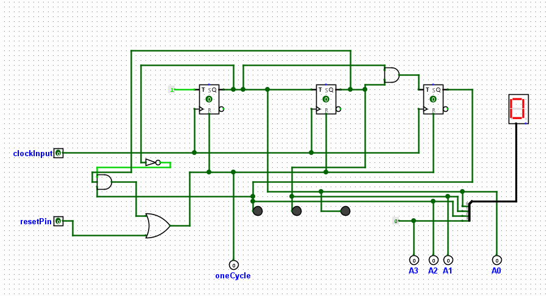
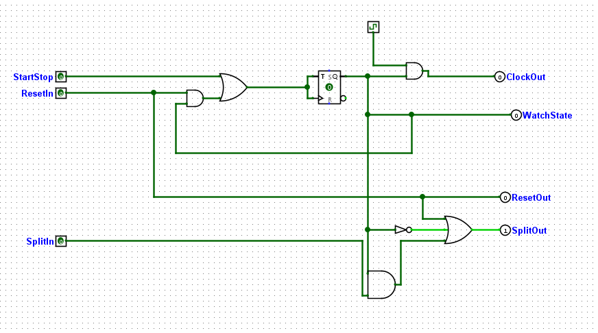
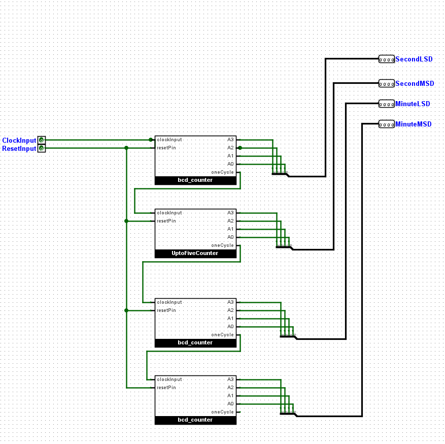
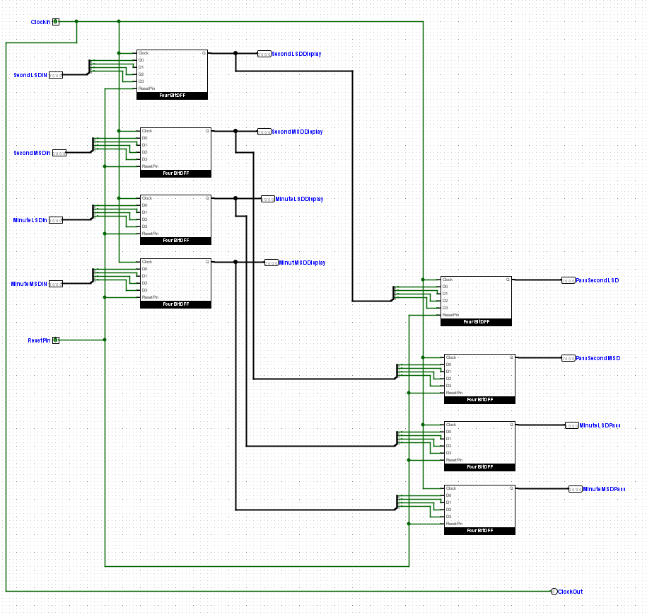
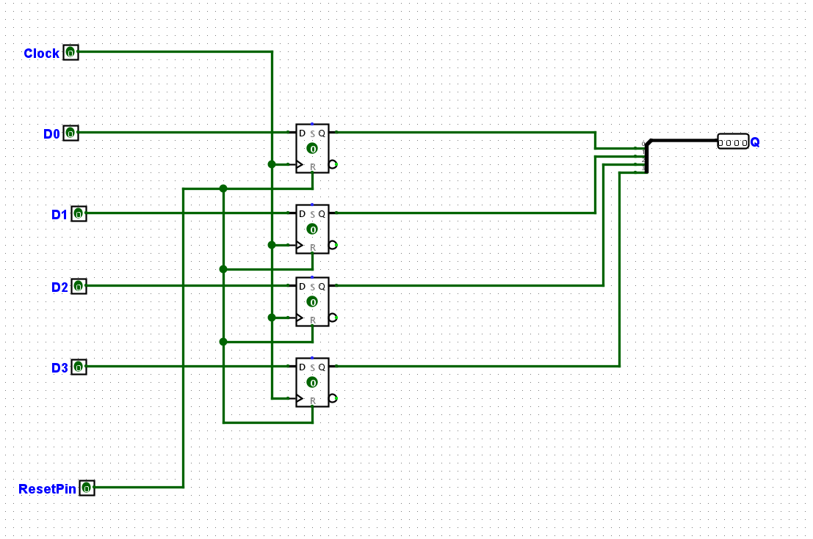

# Digital Stopwatch
This project implements a digital stopwatch using Logisim Evolution 3.8.0. The stopwatch interface allows users to start, stop, reset, and record split times. The implementation is divided into several stages, each building upon the previous stage's functionality.

## Getting Started
To run the stopwatch circuit, you need to download Logisim Evolution 3.8.0 from this link and open the provided main.circ file.

## Stages
### Stage 1: Implement the Start/Stop button
In this stage, the circuit implements a Start/Stop button that toggles between the Start and Stop states every time it is clicked. The circuit uses a flip flop to keep track of the current state, and the "Clock Started" LED indicates the state (on for Start and off for Stop).

### Stage 2: Implement a single digit "Seconds" display

This stage introduces a counter that keeps track of the number of seconds elapsed since the Start button was pressed. The counter increments the "Seconds" display by 1 second every clock tick, ranging from 0 to 9. The "Seconds" display starts from "00" when the Start/Stop button is first pressed and stops counting when the button is pressed in the Start state. It resumes counting when the button is pressed in the Stop state.

### Stage 3: Implement the full two-digit "Seconds" display

In this stage, the "Seconds" display shows the elapsed time in 1-second increments using both the units and tens columns. The display ranges from "00" to "59" and wraps back to "00" after reaching "59". The display resets to all zeros when the Reset button is clicked, entering the Stop state.

### Stage 4: Implement the "Minutes" display
This stage implements the "Minutes" display using the two hex digit displays labeled "Minutes". The display shows decimal values from "00" to "99" and wraps back to "00". The "Minutes" display only increments when the "Seconds" display wraps back to "00". The Start/Stop and Reset buttons work for the "Minutes" display as they do for the "Seconds" display.

### Stage 5: Implement the "Split" button
The "Split" button allows recording and displaying intermediate times or lap times. The circuit uses the second "Split Time" display to show the stopwatch time at the moment the "Split" button is pressed. The display remains unchanged until the next "Split" button press or Reset button press. If the Reset button is pressed, the "Split" Time display shows "00:00".

### Stage 6: Implement "Split" time recording and multi-"Split" display
In this stage, the circuit allows recording up to 5 separate "Split" times during a single timed activity. It uses flip flops to store the split times. When the stopwatch is active, the circuit records the current "Split" time when the "Split" button is pressed. It retains the last 5 split times and displays the most recent split time on the "Split Time" display. When the Reset button is pressed, all recorded split times are set to 0.

## Images 

### Full View

### Left Side

### Right Side

### BCD Counter

### Upto 5 Counter Time

### Control Unit

### Elapsed Time Display

### Split Time Display

### 4 Bit DFF

